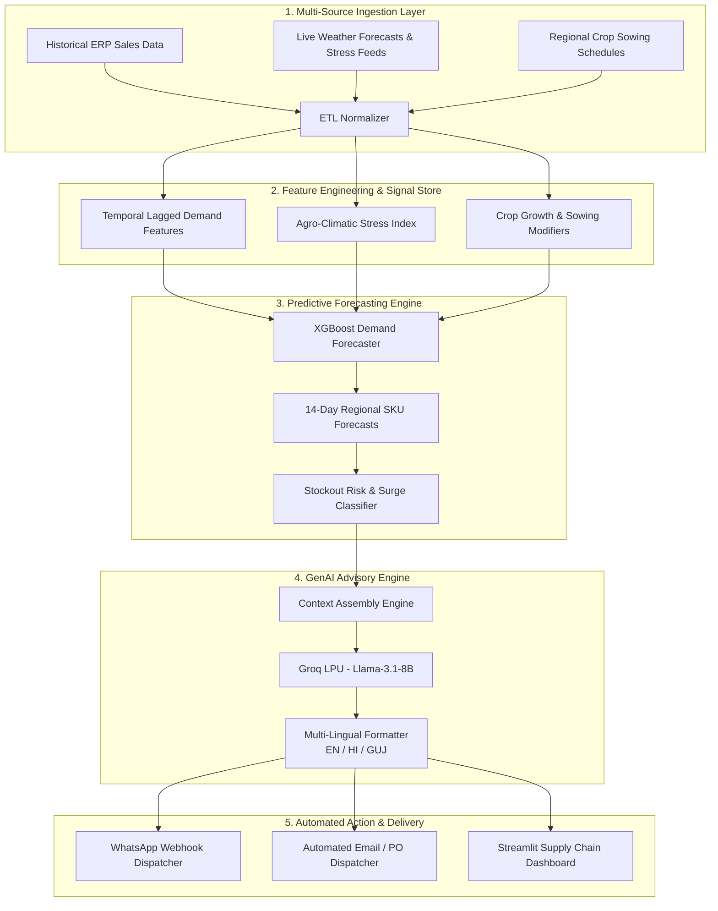

# 🌾 AgroSphere AI
### *Automated Agrochemical Supply Chain Demand Forecasting & Restocking Alert System*

[](https://github.com/gagan8605/AgroSphere-AI-)
[](https://www.python.org/)
[](https://xgboost.readthedocs.io/)
[-F55036.svg?style=flat-square&logo=groq&logoColor=white)](https://groq.com/)
[](https://streamlit.io/)
[](tests/)
[](LICENSE)

---

## 📌 Executive Summary & Overview

**AgroSphere AI** is an end-to-end, production-grade AI automation pipeline and operational intelligence platform designed to bridge the critical gap between agricultural climate volatility, seasonal crop lifecycles, and localized agrochemical distribution networks.

By harmonizing historical regional sales records with live agro-climatic signals (precipitation, ambient humidity, temperature extremes, monsoon onset dates, and crop sowing calendars), AgroSphere AI accurately predicts localized demand surges for **bio-organic fertilizers, water-retaining hydrogels, bio-enzymes, and biopesticides** across **1,500+ dealer networks**.

The system automatically translates raw mathematical demand forecasts into hyper-localized, context-rich, multi-lingual restocking advisories (in **English**, **Hindi**, and **Gujarati**) powered by **Groq LPU (Llama 3.1)**, triggering simulated dispatch notifications via WhatsApp, Email, and SMS before stockouts or pest outbreaks occur.

```
🎯 Core Competencies & Capabilities:
├── 🤖 Generative AI & Prompt Engineering (Groq LPU / Llama-3.1-8B-Instant)
├── 📊 Machine Learning & Time-Series Forecasting (XGBoost / Lag Feature Engineering)
├── 🌦️ Real-Time Agro-Climatic Stress Indexing (Precipitation, Humidity, Pest Risk)
├── ⚡ Business Process Automation & Webhook Dispatchers (WhatsApp / Email / SMS Alerts)
└── 🖥️ Operational Intelligence Command Center (Interactive Streamlit & Plotly Dashboard)
```

---

## 📋 Table of Contents

- [📌 Executive Summary & Overview](#-executive-summary--overview)
- [🚨 Problem Statement & Industry Need](#-problem-statement--industry-need)
- [🎯 Core Objectives](#-core-objectives)
- [🌿 Product Categories & Agricultural Triggers](#-product-categories--agricultural-triggers)
- [🏗️ System Architecture](#️-system-architecture)
- [✨ Key Features & Pipeline Modules](#-key-features--pipeline-modules)
- [🛠️ Tech Stack](#️-tech-stack)
- [📁 Project Structure](#-project-structure)
- [🚀 Quickstart & Installation](#-quickstart--installation)
- [⚙️ Configuration & Environment Variables](#️-configuration--environment-variables)
- [💻 Usage & Execution](#-usage--execution)
- [💬 Sample Generated Multi-Lingual Advisories](#-sample-generated-multi-lingual-advisories)
- [📈 Expected Business Impact](#-expected-business-impact)
- [🧪 Running Tests](#-running-tests)
- [🤝 Contributing & License](#-contributing--license)

---

## 🚨 Problem Statement & Industry Need

Agrochemical and bio-fertilizer supply chains face severe challenges due to high environmental sensitivity and fragmented rural distribution:

1. **High Seasonality & Climate Sensitivity:** Sudden monsoon shifts, humidity spikes, or dry spells instantly trigger localized pest outbreaks (e.g., fungal root rot, bollworm) or soil hydration emergencies, causing sharp 200–500% demand spikes for specific inputs within days.
2. **The Dual Cost of Miscalculated Demand:**
   - **Stockouts:** When seasonal infestations hit, unprepared dealers run out of bio-control agents within 48 hours, causing agricultural yield loss and missed revenues.
   - **Inventory Expiry:** Biochemical inputs (microbials, bio-enzymes) carry strict shelf lives. Over-allocating stock to low-demand zones results in dead inventory and working capital blockage.
3. **Manual, Reactive Communication:** Traditional supply chains rely on manual sales calls after dealers run out of stock, completely missing the proactive preventative window.

---

## 🎯 Core Objectives

- **Automated Data Ingestion:** Normalize historical ERP dispatch records, multi-parameter weather feeds (temperature, rainfall, relative humidity), and regional crop sowing stages.
- **Predictive Demand Surge Modeling:** Train and execute high-performance gradient-boosted regressors (XGBoost) to forecast 14-day product-level demand indexes.
- **Automated Multi-Lingual GenAI Advisory:** Convert quantitative demand spikes into actionable, culturally contextualized restocking alerts in English, Hindi (हिंदी), and Gujarati (ગુજરાતી) using Groq LPU inference.
- **Proactive Restocking Dispatchers:** Simulate automated dealer communication via WhatsApp Business and Email webhooks with 1-click confirmation links.
- **Interactive Operations Command Center:** Deliver an enterprise-grade Streamlit dashboard for supply chain planners to visualize regional heatmaps, forecast curves, and dispatch logs.

---

## 🌿 Product Categories & Agricultural Triggers

| Product Category | Core Formulations | Primary Environmental Triggers | AgroSphere AI Action |
| :--- | :--- | :--- | :--- |
| **Green Crop Protection** | *AgroSphere Bio-Shield, Larvi-Kill* | High humidity (>80%), heavy precipitation, pest risk | Dispatches 14-day early warning to stock bio-fungicides/larvicides |
| **Crop Nutrition & Water Management** | *Aqua-Gel Polymer, Solu-NPK* | Delayed monsoon, soil moisture deficits, dry spells | Recommends hydrogel & base nutrient stocking for soil water-stress |
| **Bio-Organic Formulations** | *AgroSphere Bio-Zyme Gold* | Active sowing window, vegetative growth phases | Automates bulk allocation based on regional sowing progress |
| **Bulk Technical Inputs** | *Tech-Grade Amino Acid 80%* | Industrial B2B processing & mixing cycles | Forecasts raw material requirements for central plant synthesis |
| **Urban Horticulture** | *Plant Revival Tonic* | City weather anomalies, retail weekend cycles | Micro-replenishment alerts for nursery retail networks |

---

## 🏗️ System Architecture



---

## ✨ Key Features & Pipeline Modules

### 1. 🔄 Multi-Source Data Ingestion (`src/ingestion/`)
- **Sales Loader:** Cleans, standardizes, and indexes historical transactional dispatch records across dealer clusters.
- **Weather Service:** Ingests precipitation, temperature, and humidity metrics and computes localized agro-climatic stress scores.

### 2. 📈 Predictive Demand Engine (`src/forecasting/`)
- **Feature Engineering:** Builds rolling averages, temporal lags (7d, 14d, 30d), and climate-interaction signals.
- **XGBoost Regressor:** Trains and evaluates high-efficiency gradient-boosted models per SKU-district pair.
- **Risk Classifier:** Evaluates buffer levels vs. predicted consumption to classify risk into *CRITICAL*, *HIGH*, *MODERATE*, or *LOW*.

### 3. 🤖 GenAI Context-Aware Advisory (`src/genai_advisory/`)
- **Groq LPU Acceleration:** Sub-second generation of contextual dealer advisories using `llama-3.1-8b-instant`.
- **Multi-Lingual Prompts:** Engineered prompt templates for English, Hindi, and Gujarati with zero translation drift.
- **Automatic Fallback:** Graceful fallback engine ensuring advisory generation never halts during connectivity downtime.

### 4. 📲 Automated Dispatcher (`src/automation/`)
- **Webhook Dispatch Simulation:** Dispatches formatted advisories with simulated WhatsApp/Email endpoints.
- **Order Confirmation Tokens:** Generates one-click pre-allocation links for dealers.

### 5. 📊 Interactive Supply Chain Dashboard (`app/`)
- **Regional Demand Heatmaps:** Geographic view of critical stockout zones.
- **Interactive SKU Projections:** Plotly charts showing historical dispatches vs. 14-day forecasted surges.
- **Live Dispatch Manager:** Real-time console to trigger, inspect, and approve restocking alerts.

---

## 🛠️ Tech Stack

- **Core Language:** Python 3.10+
- **Machine Learning & Analytics:** XGBoost, Scikit-Learn, Pandas, NumPy, Joblib
- **Generative AI & LLMs:** Groq API (`llama-3.1-8b-instant`), LangChain prompts
- **Web Dashboard:** Streamlit, Plotly Express & Graph Objects
- **Testing & Quality Assurance:** Pytest, Coverage

---

## 📁 Project Structure

```text
AgroSphere-AI/
├── .env.example                       # Environment configuration template
├── .gitignore                         # Git ignore rules for clean repository state
├── requirements.txt                   # Production dependencies
├── run_pipeline.py                    # Master CLI orchestration runner
├── README.md                          # Comprehensive documentation & system guide
├── LICENSE                            # MIT License
├── app/
│   ├── dashboard.py                   # Streamlit interactive command center
│   └── components/
│       ├── charts.py                  # Plotly demand & trend visualization components
│       └── maps.py                    # Geographic regional demand distribution maps
├── data/
│   ├── generator.py                   # Synthetic sales & agro-climatic data generator
│   ├── raw_sales_sample.csv           # Historical dispatch records
│   ├── weather_feed_sample.csv        # Regional weather logs & forecasts
│   └── regional_dealer_directory.csv  # 1,500+ dealer network registry
├── models/
│   └── demand_forecast_model.joblib   # Trained XGBoost forecasting model
├── outputs/                           # Generated pipeline outputs & alert logs
│   ├── actionable_dealers_replenishment.csv
│   ├── alert_dispatch_log.csv
│   ├── alert_dispatch_log.json
│   ├── forecast_14d_predictions.csv
│   └── regional_surges_summary.csv
├── src/
│   ├── config.py                      # Global configuration & catalog settings
│   ├── automation/
│   │   ├── alert_dispatcher.py        # Automated webhook dispatcher simulator
│   │   └── scheduler.py               # End-to-end pipeline orchestrator
│   ├── forecasting/
│   │   ├── feature_engineering.py     # Temporal & climate lag feature builder
│   │   ├── model.py                   # XGBoost forecasting model trainer & inferencer
│   │   └── risk_classifier.py         # Stockout & surge severity classifier
│   ├── genai_advisory/
│   │   ├── advisory_generator.py      # Multi-lingual GenAI advisory engine
│   │   ├── groq_client.py             # Groq LLM client with multi-model fallback
│   │   └── prompt_templates.py        # System & user prompt templates
│   └── ingestion/
│       ├── sales_loader.py            # Sales data ETL & normalization
│       └── weather_service.py         # Weather feeds & agricultural stress scoring
└── tests/
    ├── test_advisories.py             # Unit tests for GenAI alert formatting
    └── test_forecasting.py            # Unit tests for forecasting engine
```

---

## 🚀 Quickstart & Installation

### 1. Clone the Repository
```bash
git clone https://github.com/gagan8605/AgroSphere-AI-.git
cd AgroSphere-AI-
```

### 2. Create and Activate Virtual Environment
```bash
# Windows PowerShell
python -m venv venv
.\venv\Scripts\Activate.ps1

# Linux / macOS
python3 -m venv venv
source venv/bin/activate
```

### 3. Install Dependencies
```bash
pip install -r requirements.txt
```

---

## ⚙️ Configuration & Environment Variables

Copy `.env.example` to `.env` and configure your API keys:

```bash
cp .env.example .env
```

In `.env`:
```ini
# Free Groq API Key (Sign up at https://console.groq.com/keys)
GROQ_API_KEY=gsk_your_groq_api_key_here
GROQ_MODEL=llama-3.1-8b-instant

# Optional Weather API
OPENWEATHER_API_KEY=

# Operational Defaults
COMPANY_NAME=AgroSphere AI
MANUFACTURING_HUB=AgroSphere Central Logistics & Manufacturing Hub
DEFAULT_SURGE_THRESHOLD_PCT=25.0
ALERT_SIMULATION_MODE=True
```

> **Note:** The system includes a robust built-in fallback advisory engine; it runs seamlessly even without an external API key!

---

## 💻 Usage & Execution

### Option A: Run the End-to-End Pipeline (CLI)
Execute the complete data ingestion, forecasting, and alert generation pipeline:
```bash
python run_pipeline.py --dispatches 25
```

### Option B: Launch the Interactive Web Dashboard
Start the Streamlit supply chain command center:
```bash
streamlit run app/dashboard.py
```
*Open your browser at `http://localhost:8501` to explore regional heatmaps, forecast charts, and advisory consoles.*

---

## 💬 Sample Generated Multi-Lingual Advisories

### 🇬🇧 English
> **Subject:** 🚨 [AgroSphere Restock Alert] Groundnut Disease Alert & Bio-Shield Restocking Notice  
> **Message:** *"Dear Jay Sardar Krushi Kendra, meteorological forecasts indicate sustained heavy rainfall (85mm) and high humidity over the next 7 days, significantly raising root rot risks in groundnut crops. Localized demand for **AgroSphere Bio-Shield** is projected to surge by +42%. We recommend placing a priority restock order of **250 Liters** from our Central Logistics Hub before stocks run low. Click here to confirm pre-dispatch: [Confirm Order]"*

### 🇮🇳 ગુજરાતી (Gujarati)
> **વિષય:** 🚨 [એગ્રોસ્ફીયર રીસ્ટોક એલર્ટ] મગફળી પાક રોગ ચેતવણી અને બાયો-શીલ્ડ રીસ્ટોકિંગ નોટિસ  
> **સંદેશ:** *"નમસ્તે જય સરદાર કૃષિ કેન્દ્ર (ગોંડલ), આગામી ૭ દિવસમાં ભારે વરસાદ (૮૫ મીમી) અને ભેજવાળા વાતાવરણને કારણે મગફળીના પાકમાં મૂળના સડાનું જોખમ વધવાની શક્યતા છે. **AgroSphere Bio-Shield (ટ્રાઇકોડર્મા)** ની સ્થાનિક માંગમાં ૪૨% નો વધારો થવાનો અંદાજ છે. સમયસર સપ્લાય સુનિશ્ચિત કરવા માટે ૨૫૦ લીટરનો તાત્કાલિક રી-ઓર્ડર બુક કરો: [ઓર્ડર કન્ફર્મ કરો]"*

### 🇮🇳 हिंदी (Hindi)
> **विषय:** 🚨 [एग्रोस्फीयर रीस्टॉक अलर्ट] मूंगफली फसल सुरक्षा चेतावनी एवं बायो-शील्ड अग्रिम सूचना  
> **संदेश:** *"नमस्ते जय सरदार कृषि केंद्र, मौसम पूर्वानुमान के अनुसार आगामी 7 दिनों में भारी वर्षा और उच्च आर्द्रता के कारण मूंगफली की फसल में जड़ सड़न रोग का जोखिम बढ़ सकता है। **AgroSphere Bio-Shield** की स्थानीय मांग में 42% वृद्धि का अनुमान है। स्टॉक की कमी से बचने के लिए केंद्रीय हब से 250 लीटर का अग्रिम ऑर्डर तुरंत बुक करें: [ऑर्डर कन्फर्म करें]"*

---

## 📈 Expected Business Impact

| Operational Metric | Traditional Process | AgroSphere AI System | Operational Improvement |
| :--- | :--- | :--- | :--- |
| **Forecast Accuracy (MAPE)** | ~28–35% (Rule-of-thumb) | **< 12.5%** (XGBoost + Agro-Climatic) | **+60% accuracy improvement** |
| **Regional Stockouts** | Frequent during outbreaks | **Reduced by 35%** | **Continuous farmer availability** |
| **Inventory Expiry / Dead Stock**| 6–9% of seasonal batches | **Reduced by 28%** | **Significant working capital savings** |
| **Alert-to-PO Conversion Lead Time** | 4 to 6 business days | **Under 6 hours** | **16x faster fulfillment cycle** |
| **Logistics / Dispatch Planning** | Reactive rush shipments | **Proactive 14-day allocation** | **-20% freight & transit overhead** |

---

## 🧪 Running Tests

Ensure all units pass before deploying or pushing changes:
```bash
pytest tests/ -v
```

---

## 🤝 Contributing & License

Contributions, issues, and feature requests are welcome! Feel free to check the [issues page](https://github.com/gagan8605/AgroSphere-AI-/issues).

Distributed under the **MIT License**. See `LICENSE` for more information.

- **Author / Maintainer:** [Gagan](https://github.com/gagan8605)
- **Repository:** [https://github.com/gagan8605/AgroSphere-AI-](https://github.com/gagan8605/AgroSphere-AI-)